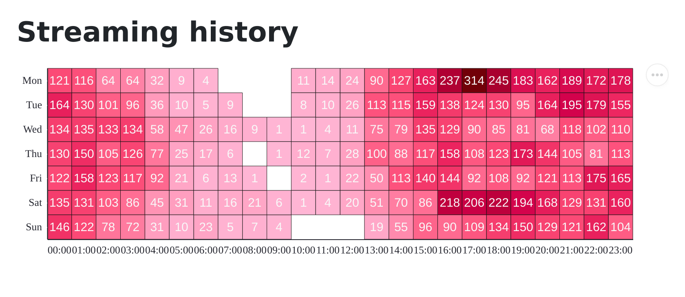

# Git Scraping Spotify

## Status

This repo is retired. It is kept as a historical generated dataset, Pages, and
screenshot archive for the Spotify/git-scraping migration.

Current canonical listening data now lives in
[`chekos/my-spotify-data`](https://github.com/chekos/my-spotify-data). Current
analytics and GitHub Pages output live in
[`chekos/my-spotify-analytics`](https://github.com/chekos/my-spotify-analytics).

GitHub Actions in this repo are retained only for recovery reference and should
remain disabled unless there is an intentional historical rebuild.

## Queries
* [Number of tracks played by :artist by album artist (defaults to Fntxy)](https://lite.datasette.io/?url=https://github.com/chekos/git-scraping-spotify/blob/main/tracks.db&install=datasette-spotify-embed&install=datasette-vega#/tracks?sql=select%0A++date%28played_at%29+date_played_at%2C%0A++album_artist_name%2C%0A++count%28*%29+as+n_played%0Afrom%0A++tracks%0Awhere%0A++%22track_artists%22+like+%0A++case%0A++++%3Aartist%0A++when+%27%27+then+%27%25fntxy%25%27%0A++++else+%27%25%27+%7C%7C+%3Aartist+%7C%7C+%27%25%27%0A++end%0Agroup+by%0A++1%2C2%0Aorder+by%0A++rowid&artist=fntxy)

* [Number of times a track is played by :artist (defaults to Fntxy)](https://lite.datasette.io/?url=https://github.com/chekos/git-scraping-spotify/blob/main/tracks.db&install=datasette-spotify-embed&install=datasette-vega#/tracks?sql=select%0A++date%28played_at%29+date_played_at%2C%0A++album_artist_name%2C%0A++track_name%2C%0A++count%28*%29+as+n_played%0Afrom%0A++tracks%0Awhere%0A++%22track_artists%22+like+%0A++case%0A++++%3Aartist%0A++when+%27%27+then+%27%25fntxy%25%27%0A++++else+%27%25%27+%7C%7C+%3Aartist+%7C%7C+%27%25%27%0A++end%0Agroup+by%0A++1%2C2%2C3%0Aorder+by%0A++rowid&artist=fntxy)
